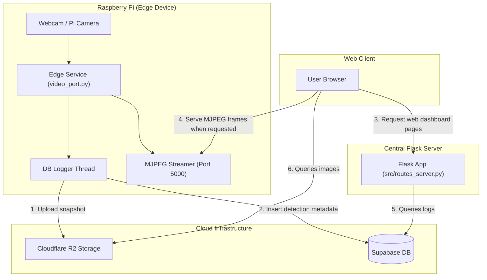

## Architectural Diagram

```mermaid
graph TD
    subgraph Edge ["Raspberry Pi (Edge Device)"]
        Camera["Webcam / Pi Camera"]
        PiService["Edge Service (video_port.py)"]
        DBLogger["DB Logger Thread"]
        StreamServer["MJPEG Streamer (Port 5000)"]

        Camera --> PiService
        PiService --> DBLogger
        PiService --> StreamServer
    end

    subgraph CloudServices ["Cloud Infrastructure"]
        Storage["Cloudflare R2 Storage"]
        Supabase[("Supabase DB")]
    end

    subgraph Server ["Central Flask Server"]
        FlaskServer["Flask App (src/routes_server.py)"]
    end

    subgraph Client ["Web Client"]
        Browser["User Browser"]
    end

    DBLogger -->|1. Upload snapshot| Storage
    DBLogger -->|2. Insert detection metadata| Supabase
    Browser -->|3. Request web dashboard pages| FlaskServer
    Browser -->|4. Serve MJPEG frames when requested| StreamServer
    FlaskServer -->|5. Queries logs| Supabase
    Browser -->|6. Queries images| Storage
```