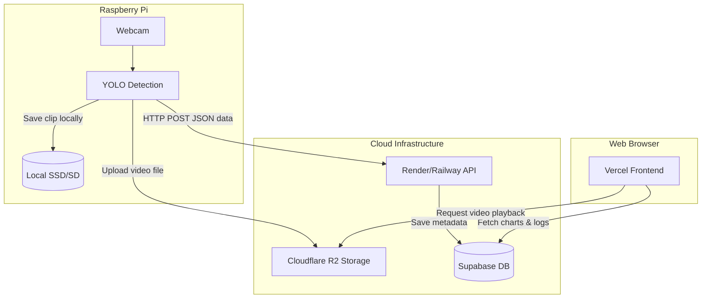

### How the Data Flows (Pi ➡️ Cloud ➡️ Website)

```mermaid
graph TD
    subgraph Edge ["Raspberry Pi"]
        Camera[Webcam] --> Inference["YOLO Detection"]
        LocalStorage[("Local SSD/SD")]
        Inference -->|Save clip locally| LocalStorage
    end

    subgraph CloudServices ["Cloud Infrastructure"]
        CloudStorage["Cloudflare R2 Storage"]
        CloudBackend["Render/Railway API"]
        DB[("Supabase DB")]
        CloudBackend -->|Save metadata| DB
    end

    subgraph User ["Web Browser"]
        Website["Vercel Frontend"]
    end

    %% Cross-subgraph connections
    Inference -->|Upload video file| CloudStorage
    Inference -->|HTTP POST JSON data| CloudBackend
    Website -->|Fetch charts & logs| DB
    Website -->|Request video playback| CloudStorage
```